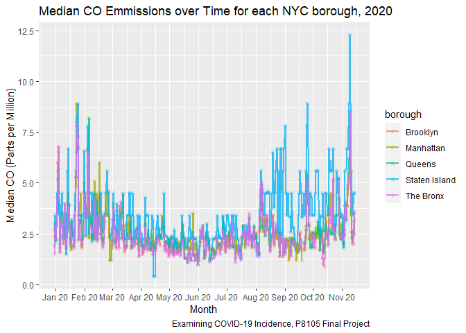
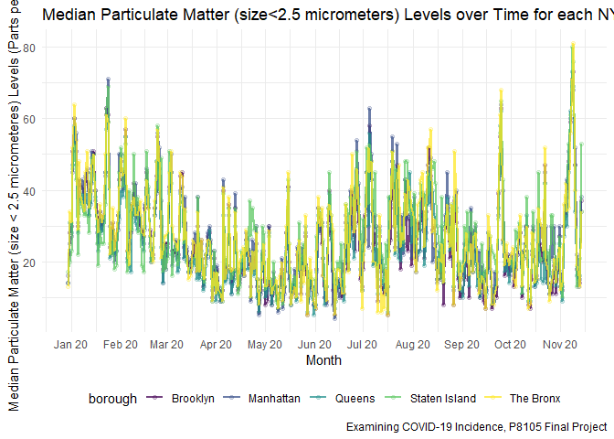
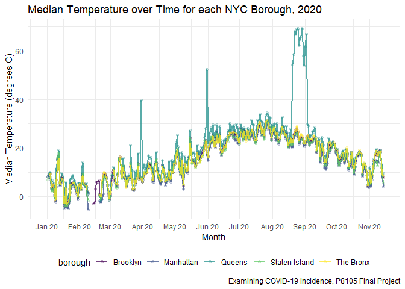

Data Cleaning
================

## Setup

## COVID Case Data

Reading in the data and basic cleaning.

``` r
nyc_cases =
  GET("https://data.cityofnewyork.us/resource/rc75-m7u3.csv") %>% # Reading in the data
  content("parsed") %>% 
  rename(date = date_of_interest) %>% # Renaming the date variable for simplicity
  select(date, case_count) %>% # Only retaining date and case count for simplicity
  mutate(
    date = as.Date(date, tryFormats = c("%Y-%m-%d")) # as.Date() by default cannot convert POSIXct to date; no data lost
  )
## Note: This dataset also contains hospitalized count and death count.
## I removed those measures for now for simplicity, but we can always decide to retain them later if we think they would be useful.
```

Trying out a simple plot of cases over time.

``` r
nyc_cases %>% 
  ggplot(aes(x = date, y = case_count, color = case_count)) + 
    geom_point(alpha = .2) +
    geom_line(alpha = .75, size = .75) +
      scale_x_date(date_breaks = "1 month", date_labels = "%b %y") +
      scale_y_continuous(breaks = seq(0, 6500, 500)) +
  labs(
    title = "COVID-19 New Cases Per Day, NYC, 2020",
    x = "Month",
    y = "Case Count (Persons)",
    caption = "Examining COVID-19 Incidence, P8105 Final Project") 
```

<<<<<<< HEAD
    ## ── Attaching packages ────────────────────────────────────────────────────────────────────────────────────────────────────────────────────────────────────────────────────────────────────────── tidyverse 1.3.0 ──

    ## ✓ ggplot2 3.3.2     ✓ purrr   0.3.4
    ## ✓ tibble  3.0.3     ✓ dplyr   1.0.2
    ## ✓ tidyr   1.1.2     ✓ stringr 1.4.0
    ## ✓ readr   1.3.1     ✓ forcats 0.5.0

    ## ── Conflicts ───────────────────────────────────────────────────────────────────────────────────────────────────────────────────────────────────────────────────────────────────────────── tidyverse_conflicts() ──
    ## x dplyr::between()   masks data.table::between()
    ## x dplyr::filter()    masks stats::filter()
    ## x dplyr::first()     masks data.table::first()
    ## x dplyr::lag()       masks stats::lag()
    ## x dplyr::last()      masks data.table::last()
    ## x purrr::transpose() masks data.table::transpose()
=======
<!-- -->

``` r
nyc_daily_borough_testing =
  read_csv(
      "./data/covid_data/nyc_daily_covid.csv") %>% 
  janitor::clean_names() %>% 
  rename(date = date_of_interest) %>% 
  mutate(
    date = as.Date(date, format = "%m/%d/%Y")
  ) %>%
  pivot_longer(
    bx_case_count:si_death_count_7day_avg,
    names_to = "borough_variable",
    values_to = "observed_value"
  ) %>% 
  mutate(
    borough_variable = str_replace(borough_variable, "bx_", "Bronx/"),
    borough_variable = str_replace(borough_variable, "bk_", "Brooklyn/"),
    borough_variable = str_replace(borough_variable, "qn_", "Queens/"),
    borough_variable = str_replace(borough_variable, "si_", "Staten Island/"),
    borough_variable = str_replace(borough_variable, "mn_", "Manhattan/")
  ) %>% 
  separate(borough_variable, into = c("borough", "observation_type"), sep = "/") %>% 
  arrange(date, borough, observation_type, observed_value) %>% 
  pivot_longer(
    case_count:incomplete,
    names_to = "total_observation_type",
    values_to = "total_observed_value"
  ) %>% 
  filter(observation_type == c("case_count", "case_count_7day_avg"))

#add proof-of-concept covid policy changes to df
nyc_daily_borough_testing = 
  nyc_daily_borough_testing %>% 
  mutate(
    policy_change = case_when(
      date == "2020-03-07" ~ "State of Emergency",
      date == "2020-03-17" ~ "DeBlasio / Cuomo Conflict on Shutdown",
      date == "2020-03-22" ~ "PAUSE Order",
      date == "2020-08-08" ~ "Phase 1 Opening",
      date == "2020-08-17" ~ "Gyms Starting",
      date == "2020-10-01" ~ "Primary Schools"),
    dates_vline = date,
    dates_vline = case_when(
      date == "2020-03-07" ~ "TRUE",
      date == "2020-03-17" ~ "TRUE",
      date == "2020-03-22" ~ "TRUE",
      date == "2020-08-08" ~ "TRUE",
      date == "2020-08-17" ~ "TRUE",
      date == "2020-10-01" ~ "TRUE")
  )
```

``` r
nyc_daily_borough_testing %>% 
  filter(observation_type == c("case_count")) %>% 
  group_by(date, borough, observation_type) %>% 
  ggplot(aes(x = date)) + 
  geom_line(aes(x = date, y = observed_value, color = borough)) +
  geom_smooth(
    aes(x = date, y = observed_value, color = borough), 
        alpha = 1, se = F) +
  scale_x_date(date_breaks = "1 month", date_labels = "%b %y") +
  coord_cartesian(ylim = c(0,2000)) +
  labs(
    title = "Case Count per NYC Borough over Time",
    x = "Week Number",
    y = "Value",
    caption = "P8105 Final Project") 
```

<!-- -->

``` r
nyc_daily_borough_testing %>% 
  filter(observation_type == c("case_count_7day_avg")) %>% 
  group_by(date, borough, observation_type) %>% 
  ggplot(aes(x = date, y = observed_value, color = borough)) + 
  geom_line() +
  scale_x_date(date_breaks = "1 month", date_labels = "%b %y") +
  coord_cartesian(ylim = c(0,2000)) +
  labs(
    title = "7 Day Case Count Average per NYC Borough over Time",
    x = "Week Number",
    y = "Value",
    caption = "P8105 Final Project") 
```

<!-- -->

## Air Quality Data
>>>>>>> b659014ead335e19d6e62e6a251ce3ee9cacfdfe

``` r
air_quality = fread("./data/waqi-covid19-airqualitydata-2020.csv") %>%
  filter(Country == "US") %>%
  filter(City == "Brooklyn" | City == "Queens" | City == "The Bronx" | City == "Staten Island" | City == "Manhattan") %>%
  mutate(Borough = City) %>%
  select(-c(City,Country)) %>%
  pivot_wider(names_from = "Specie", values_from = c("count","min","max","median","variance")) %>% 
  janitor::clean_names()

fwrite(air_quality,"./data/Just_NYC_Air_Quality_Data.csv")
```

``` r
air_quality %>% 
  ggplot(aes(x = date, y = median_co, color = borough)) + 
    geom_point(alpha = .2) +
    geom_line(alpha = .75, size = .75) +
      scale_x_date(date_breaks = "1 month", date_labels = "%b %y") +
  labs(
    title = "Median CO Emmissions over Time for each NYC Borough, 2020",
    x = "Month",
    y = "Median CO (Parts per Million)",
    caption = "Examining COVID-19 Incidence, P8105 Final Project") 
```

    ## Warning: Removed 92 rows containing missing values (geom_point).

    ## Warning: Removed 4 row(s) containing missing values (geom_path).

<!-- -->

``` r
air_quality %>% 
  ggplot(aes(x = date, y = median_pm25, color = borough)) + 
    geom_point(alpha = .2) +
    geom_line(alpha = .75, size = .75) +
      scale_x_date(date_breaks = "1 month", date_labels = "%b %y") +
  labs(
    title = "Median Particulate Matter (size<2.5 micrometers) Levels over Time for each NYC Borough, 2020",
    x = "Month",
    y = "Median Particulate Matter (size < 2.5 micrometeres) Levels (Parts per Millon)",
    caption = "Examining COVID-19 Incidence, P8105 Final Project") 
```

<!-- -->

``` r
air_quality %>% 
  ggplot(aes(x = date, y = median_temperature, color = borough)) + 
    geom_point(alpha = .2) +
    geom_line(alpha = .75, size = .75) +
      scale_x_date(date_breaks = "1 month", date_labels = "%b %y") +
  labs(
    title = "Median Temperature over Time for each NYC Borough, 2020",
    x = "Month",
    y = "Median Temperature (degrees C)",
    caption = "Examining COVID-19 Incidence, P8105 Final Project") 
```

    ## Warning: Removed 65 rows containing missing values (geom_point).

    ## Warning: Removed 17 row(s) containing missing values (geom_path).

<!-- -->
