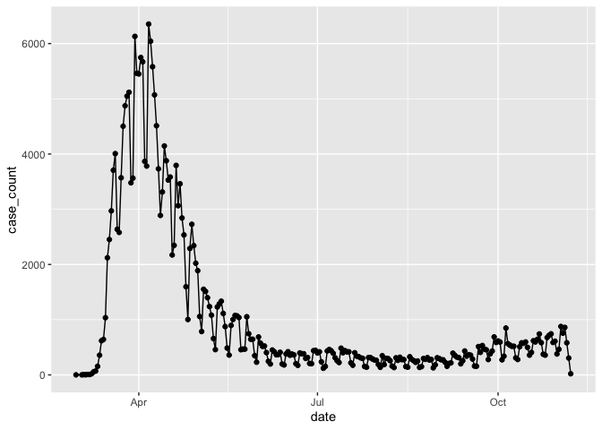

Data Cleaning
================

## COVID Case Data

Reading in the data and basic cleaning.

``` r
library(tidyverse)
library(httr)

nyc_cases =
  GET("https://data.cityofnewyork.us/resource/rc75-m7u3.csv") %>% # Reading in the data
  content("parsed") %>% 
  rename(date = date_of_interest) %>% # Renaming the date variable for simplicity
  select(date, case_count) # Only retaining date and case count for simplicity

## Note: This dataset also contains hospitalized count and death count.
## I removed those measures for now for simplicity, but we can always decide to retain them later if we think they would be useful.
```

Trying out a simple plot of cases over time.

``` r
nyc_cases %>% 
  ggplot(aes(x = date, y = case_count)) + 
  geom_point() +
  geom_line()
```

<!-- -->

## Air Quality Data
