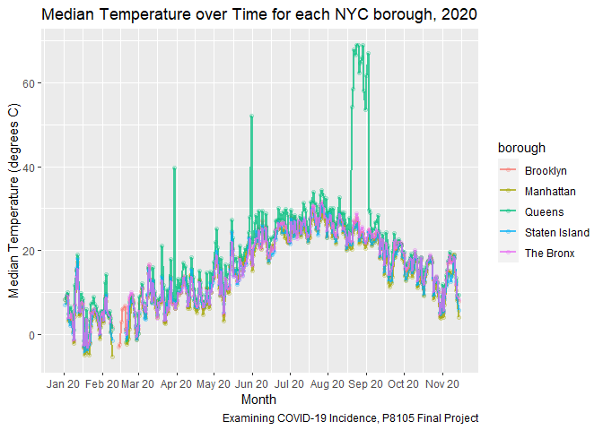

Data Cleaning
================

## COVID Case Data

``` r
# Testing 1 2 3
```

## Air Quality Data

``` r
library(data.table)
library(tidyverse)
```

    ## ── Attaching packages ────────────────────────────────────────────────────────────────────────────────────────────────────────────────────────────────────────────────────────────────────────── tidyverse 1.3.0 ──

    ## ✓ ggplot2 3.3.2     ✓ purrr   0.3.4
    ## ✓ tibble  3.0.3     ✓ dplyr   1.0.2
    ## ✓ tidyr   1.1.2     ✓ stringr 1.4.0
    ## ✓ readr   1.3.1     ✓ forcats 0.5.0

    ## ── Conflicts ───────────────────────────────────────────────────────────────────────────────────────────────────────────────────────────────────────────────────────────────────────────── tidyverse_conflicts() ──
    ## x dplyr::between()   masks data.table::between()
    ## x dplyr::filter()    masks stats::filter()
    ## x dplyr::first()     masks data.table::first()
    ## x dplyr::lag()       masks stats::lag()
    ## x dplyr::last()      masks data.table::last()
    ## x purrr::transpose() masks data.table::transpose()

``` r
air_quality = fread("./data/waqi-covid19-airqualitydata-2020.csv") %>%
  filter(Country == "US") %>%
  filter(City == "Brooklyn" | City == "Queens" | City == "The Bronx" | City == "Staten Island" | City == "Manhattan") %>%
  mutate(Borough = City) %>%
  select(-c(City,Country)) %>%
  pivot_wider(names_from = "Specie", values_from = c("count","min","max","median","variance")) %>% 
  janitor::clean_names()

fwrite(air_quality,"./data/Just_NYC_Air_Quality_Data.csv")
```

``` r
air_quality %>% 
  ggplot(aes(x = date, y = median_co, color = borough)) + 
    geom_point(alpha = .2) +
    geom_line(alpha = .75, size = .75) +
      scale_x_date(date_breaks = "1 month", date_labels = "%b %y") +
  labs(
    title = "Median CO Emmissions over Time for each NYC Borough, 2020",
    x = "Month",
    y = "Median CO (Parts per Million)",
    caption = "Examining COVID-19 Incidence, P8105 Final Project") 
```

    ## Warning: Removed 92 rows containing missing values (geom_point).

    ## Warning: Removed 4 row(s) containing missing values (geom_path).

<!-- -->

``` r
air_quality %>% 
  ggplot(aes(x = date, y = median_pm25, color = borough)) + 
    geom_point(alpha = .2) +
    geom_line(alpha = .75, size = .75) +
      scale_x_date(date_breaks = "1 month", date_labels = "%b %y") +
  labs(
    title = "Median Particulate Matter (size<2.5 micrometers) Levels over Time for each NYC Borough, 2020",
    x = "Month",
    y = "Median Particulate Matter (size < 2.5 micrometeres) Levels (Parts per Millon)",
    caption = "Examining COVID-19 Incidence, P8105 Final Project") 
```

<!-- -->

``` r
air_quality %>% 
  ggplot(aes(x = date, y = median_temperature, color = borough)) + 
    geom_point(alpha = .2) +
    geom_line(alpha = .75, size = .75) +
      scale_x_date(date_breaks = "1 month", date_labels = "%b %y") +
  labs(
    title = "Median Temperature over Time for each NYC Borough, 2020",
    x = "Month",
    y = "Median Temperature (degrees C)",
    caption = "Examining COVID-19 Incidence, P8105 Final Project") 
```

    ## Warning: Removed 65 rows containing missing values (geom_point).

    ## Warning: Removed 17 row(s) containing missing values (geom_path).

<!-- -->
