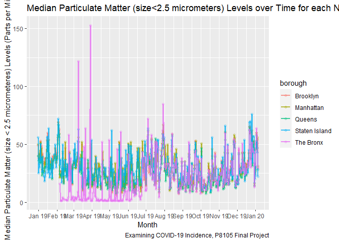
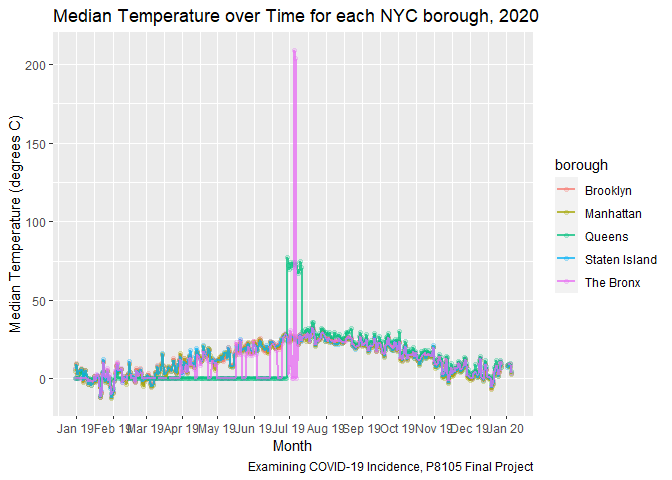

data\_cleaning\_aqi\_2019
================

## COVID Case Data

``` r
# Testing 1 2 3
```

## Air Quality Data

``` r
library(data.table)
library(tidyverse)
```

    ## -- Attaching packages ----------------------------------------- tidyverse 1.3.0 --

    ## v ggplot2 3.3.2     v purrr   0.3.4
    ## v tibble  3.0.3     v dplyr   1.0.1
    ## v tidyr   1.1.2     v stringr 1.4.0
    ## v readr   1.3.1     v forcats 0.5.0

    ## -- Conflicts -------------------------------------------- tidyverse_conflicts() --
    ## x dplyr::between()   masks data.table::between()
    ## x dplyr::filter()    masks stats::filter()
    ## x dplyr::first()     masks data.table::first()
    ## x dplyr::lag()       masks stats::lag()
    ## x dplyr::last()      masks data.table::last()
    ## x purrr::transpose() masks data.table::transpose()

``` r
setwd("./data/2019_Data/")
files = list.files(".")
air_quality_2019 = files %>%        
  map(~ fread(.x)) %>%
  reduce(rbind)%>%
  filter(Country == "US") %>%
  filter(City == "Brooklyn" | City == "Queens" | City == "The Bronx" | City == "Staten Island" | City == "Manhattan")%>%
  mutate(borough = City) %>%
  filter(Specie == "pm25" | Specie == "temperature"| Specie == "o3" | Specie == "no2" | Specie == "co")%>%
  select(-c(City,Country,variance,count))%>%
  distinct()%>%
  tidyr::pivot_wider(names_from = Specie, values_from = c(median,max,min))


fwrite(air_quality_2019,"Just_NYC_Air_Quality_Data_2019.csv")
```

``` r
air_quality_2019 %>% 
  ggplot(aes(x = Date, y = median_co, color = borough)) + 
    geom_point(alpha = .2) +
    geom_line(alpha = .75, size = .75) +
      scale_x_date(date_breaks = "1 month", date_labels = "%b %y") +
  labs(
    title = "Median CO Emmissions over Time for each NYC borough, 2020",
    x = "Month",
    y = "Median CO (Parts per Million)",
    caption = "Examining COVID-19 Incidence, P8105 Final Project") 
```

    ## Warning: Removed 112 rows containing missing values (geom_point).

    ## Warning: Removed 77 row(s) containing missing values (geom_path).

<!-- -->

``` r
air_quality_2019 %>% 
  ggplot(aes(x = Date, y = median_pm25, color = borough)) + 
    geom_point(alpha = .2) +
    geom_line(alpha = .75, size = .75) +
      scale_x_date(date_breaks = "1 month", date_labels = "%b %y") +
  labs(
    title = "Median Particulate Matter (size<2.5 micrometers) Levels over Time for each NYC borough, 2020",
    x = "Month",
    y = "Median Particulate Matter (size < 2.5 micrometeres) Levels (Parts per Millon)",
    caption = "Examining COVID-19 Incidence, P8105 Final Project") 
```

    ## Warning: Removed 37 rows containing missing values (geom_point).

    ## Warning: Removed 11 row(s) containing missing values (geom_path).

<!-- -->

``` r
air_quality_2019 %>% 
  ggplot(aes(x = Date, y = median_temperature, color = borough)) + 
    geom_point(alpha = .2) +
    geom_line(alpha = .75, size = .75) +
      scale_x_date(date_breaks = "1 month", date_labels = "%b %y") +
  labs(
    title = "Median Temperature over Time for each NYC borough, 2020",
    x = "Month",
    y = "Median Temperature (degrees C)",
    caption = "Examining COVID-19 Incidence, P8105 Final Project") 
```

    ## Warning: Removed 26 rows containing missing values (geom_point).

<!-- -->

``` r
library(tidyverse)

AQI_temp = air_quality_2019%>%
  select(Date,borough,median_pm25,median_o3,median_co,median_no2)

AQI_formula_O3 = function(AQI){
  if (AQI<=54 && AQI>=0 ){
    AQI_O3 = (50/54)*(AQI-0) + 0
  }
  
  else if (AQI<=70 && AQI>54 ){
    AQI_O3 = (50/22)*(AQI-55) + 51
  }
  
  else if (AQI<=85 && AQI>70){
    AQI_O3 = (50/14)*(AQI-70) + 101
  }
  
  else if (AQI<=105 && AQI>85 ){
    AQI_O3 = (50/19)*(AQI-86) + 151
  }
  
  else if (AQI<=200 && AQI>105 ){
    AQI_O3 = (99/94)*(AQI-106) + 201
  }
  
  else if (AQI<=404 && AQI>204){
    AQI_O3 = (99/199)*(AQI-205) + 201
  }
  
  else{
    AQI_O3 = (199/199)*(AQI-405) + 301
  }
}

AQI_formula_pm25 = function(AQI){
  if (AQI<= 12&& AQI>=0 ){
    AQI_pm25 = (50/12)*(AQI-0) + 0
  }
  
  else if (AQI<=35.4 && AQI>=12.1 ){
    AQI_pm25 = (50/23.3)*(AQI-12.1) + 51
  }
  
  else if (AQI<=55.4 && AQI>=35.5 ){
    AQI_pm25 = (50/19.9)*(AQI-35.5) + 101
  }
  
  else if (AQI<=150.4 && AQI>=55.5 ){
    AQI_pm25 = (50/94.9)*(AQI-55.5) + 151
  }
  
  else{
    AQI_pm25 = (99/99.9)*(AQI-150.5) + 201
  }
}

AQI_formula_co = function(AQI){
  if (AQI<= 4.4&& AQI>=0 ){
    AQI_co = (50/4.4)*(AQI-0) + 0
  }
  
  else if (AQI<=9.4 && AQI>=4.5 ){
    AQI_co = (50/4.9)*(AQI-4.5) + 51
  }
  
  else{
    AQI_co = (199/19.9)*(AQI-30.5) + 301
}
}

AQI_formula_no2 = function(AQI){
  if (AQI<= 53&& AQI>=0 ){
    AQI_no2 = (50/53)*(AQI-0) + 0
  }
  
  else if (AQI<=100 && AQI>=54 ){
    AQI_no2 = (50/46)*(AQI-54) + 51
  }
  
  else{
    AQI_no2 = (50/259)*(AQI-101) + 101
  }
}

AQI_O3 = AQI_temp%>%
  select(median_o3)%>%
  purrr::map(~AQI_formula_O3(.x))%>%
  data.frame()

AQI_pm25 = AQI_temp%>%
  select(median_pm25)%>%
  purrr::map(~AQI_formula_pm25(.x))%>%
  data.frame()

AQI_co = AQI_temp%>%
  select(median_co)%>%
  purrr::map(~AQI_formula_co(.x))%>%
  data.frame()

AQI_no2 = AQI_temp%>%
  select(median_no2)%>%
  purrr::map(~AQI_formula_no2(.x))%>%
  data.frame()

AQI_combined = cbind(AQI_O3,AQI_co,AQI_no2,AQI_pm25)%>%
  rowwise() %>% 
  mutate(AQI = max(median_o3,median_co,median_no2,median_pm25,na.rm=T))%>%
  cbind(air_quality_2019%>%pull(Date),
        air_quality_2019%>%pull(borough))%>%
  filter(AQI != -Inf)
```

    ## Warning: Problem with `mutate()` input `AQI`.
    ## x no non-missing arguments to max; returning -Inf
    ## i Input `AQI` is `max(median_o3, median_co, median_no2, median_pm25, na.rm = T)`.
    ## i The error occurred in row 225.

    ## Warning in max(median_o3, median_co, median_no2, median_pm25, na.rm = T): no
    ## non-missing arguments to max; returning -Inf

    ## Warning: Problem with `mutate()` input `AQI`.
    ## x no non-missing arguments to max; returning -Inf
    ## i Input `AQI` is `max(median_o3, median_co, median_no2, median_pm25, na.rm = T)`.
    ## i The error occurred in row 232.

    ## Warning in max(median_o3, median_co, median_no2, median_pm25, na.rm = T): no
    ## non-missing arguments to max; returning -Inf

    ## Warning: Problem with `mutate()` input `AQI`.
    ## x no non-missing arguments to max; returning -Inf
    ## i Input `AQI` is `max(median_o3, median_co, median_no2, median_pm25, na.rm = T)`.
    ## i The error occurred in row 233.

    ## Warning in max(median_o3, median_co, median_no2, median_pm25, na.rm = T): no
    ## non-missing arguments to max; returning -Inf

    ## Warning: Problem with `mutate()` input `AQI`.
    ## x no non-missing arguments to max; returning -Inf
    ## i Input `AQI` is `max(median_o3, median_co, median_no2, median_pm25, na.rm = T)`.
    ## i The error occurred in row 252.

    ## Warning in max(median_o3, median_co, median_no2, median_pm25, na.rm = T): no
    ## non-missing arguments to max; returning -Inf

    ## Warning: Problem with `mutate()` input `AQI`.
    ## x no non-missing arguments to max; returning -Inf
    ## i Input `AQI` is `max(median_o3, median_co, median_no2, median_pm25, na.rm = T)`.
    ## i The error occurred in row 254.

    ## Warning in max(median_o3, median_co, median_no2, median_pm25, na.rm = T): no
    ## non-missing arguments to max; returning -Inf

    ## Warning: Problem with `mutate()` input `AQI`.
    ## x no non-missing arguments to max; returning -Inf
    ## i Input `AQI` is `max(median_o3, median_co, median_no2, median_pm25, na.rm = T)`.
    ## i The error occurred in row 255.

    ## Warning in max(median_o3, median_co, median_no2, median_pm25, na.rm = T): no
    ## non-missing arguments to max; returning -Inf

    ## Warning: Problem with `mutate()` input `AQI`.
    ## x no non-missing arguments to max; returning -Inf
    ## i Input `AQI` is `max(median_o3, median_co, median_no2, median_pm25, na.rm = T)`.
    ## i The error occurred in row 265.

    ## Warning in max(median_o3, median_co, median_no2, median_pm25, na.rm = T): no
    ## non-missing arguments to max; returning -Inf

``` r
colnames(AQI_combined) = c("AQI_o3","AQI_co","AQI_no2","AQI_pm25","AQI_Final","date","borough")

AQI_combined = AQI_combined%>%
  select(c("date","borough","AQI_Final","AQI_o3","AQI_co","AQI_no2","AQI_pm25"))%>%
  mutate(AQI_Category = if_else(
    AQI_Final<=50 & AQI_Final>=0,"Good",
    if_else(AQI_Final<=100&AQI_Final>50,"Moderate",
    if_else(AQI_Final<=150&AQI_Final>100,"Unhealthy for Sensitive Populations",if_else(AQI_Final<=200&AQI_Final>150,"Unhealthy",if_else(AQI_Final<=300&AQI_Final>200,"Very Unhealthy","Hazardous"))))))


fwrite(AQI_combined,"./data/2019_Data/Air_Quality_Data_with_AQI_2019.csv")
```
