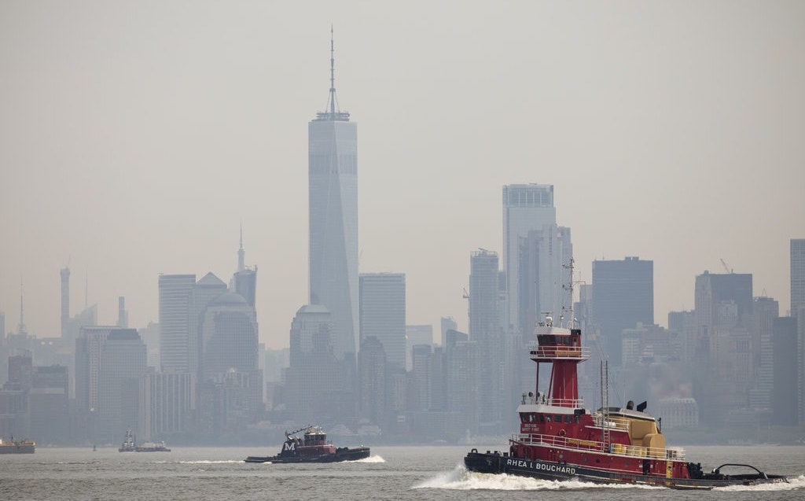

*Source: Drew Angerer/Getty Images (via [The New York Times](https://www.nytimes.com/2019/08/13/well/live/how-to-reduce-exposure-to-air-pollution.html)).*

## Introduction

The COVID-19 pandemic has accelerated longstanding inequity in our society and dramatically shifted social, economic, and environmental patterns in NYC. As COVID-19 epidemiological patterns have shifted, so too have the city’s policy guidance and residents’ behavior. To better understand the impact of the COVID-19 pandemic on NYC’s social ecology, we examine air quality trends over time in relation to public health guidance to stay home and cease all non-essential business function.

## Website Overview

[**Dashboard:**](https://asingh100.shinyapps.io/dashboard/) Here you will find the main deliverable of this project, an interactive dashboard displaying trends in New York City air quality in relation to the COVID-19 pandemic.

[**Report:**](report.html) This written report summarizes how we completed our project, including details on data collection and cleaning, exploratory analyses, discussion of results, and more.

[**Process:**](process.html) Here we provide additional details on our process, including intermediate outputs that didn't make the final cut but helped guide our final product.

[**Screencast:**](screencast.html) Check out a 2-minute video illustrating our project.
